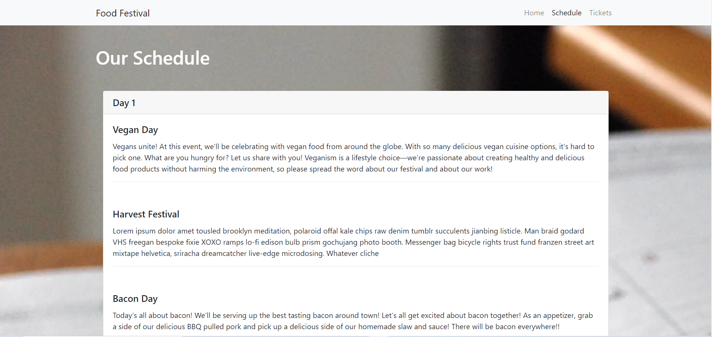

# Food Festival

## Description
Progressive Web Application functioning as a brochure for a 3-day Food Festival.  Application features a full-screen image carousel and includes schedule of events and form for purchasing tickets to the festival.  

##### Homescreen

##### Schedule Page

##### Tickets Page

##### Purchase Ticket Form

Visit site [here](https://christopherconcannon.github.io/food-festival/)

## Table of Contents
  * [Installation](#installation)
  * [Usage](#usage)
  * [License](#license)
  * [Technologies](#technologies)
  * [Contributing](#contributing)
  * [Testing](#testing)
  * [Questions](#questions)
  
## Installation
Clone project to a directory on your local machine and cd into food-festival directory.  Run <$ npm install> to install dependencies.  See package.json for other available scripts.

## Usage
Open index.html file in your choice of browser to view the application and interact through the menu.

## License 
This project is covered under the MIT license 

## Technologies 
HTML, CSS, jQuery, Bootstrap, Webpack

## Contributing
To see the guidelines adopted for contributing to this project, please view the [Contributor Covenant](https://www.contributor-covenant.org/version/2/0/code_of_conduct/code_of_conduct.txt)

## Testing
Tests coming soon

## Questions
Visit me at GitHub  
[christopherConcannon](https://github.com/christopherConcannon)
  
If you have any questions or would like to contact me, please email me at  
[cmcon@yahoo.com](mailto:cmcon@yahoo.com)
